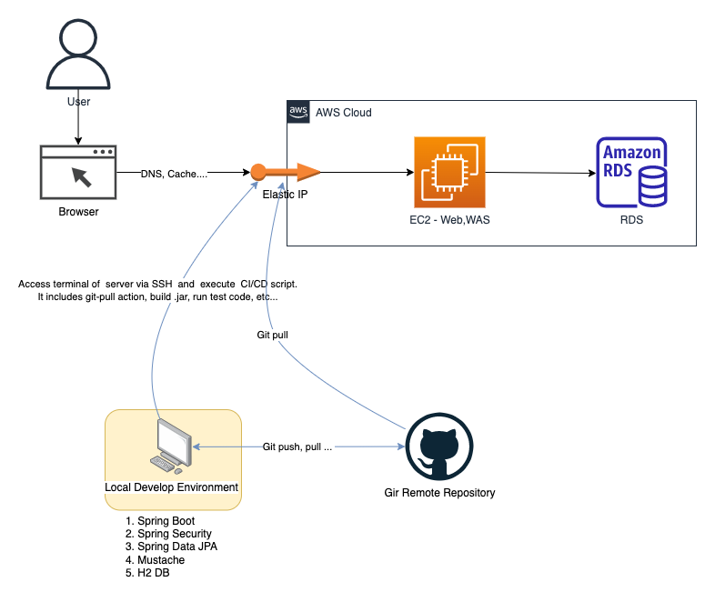
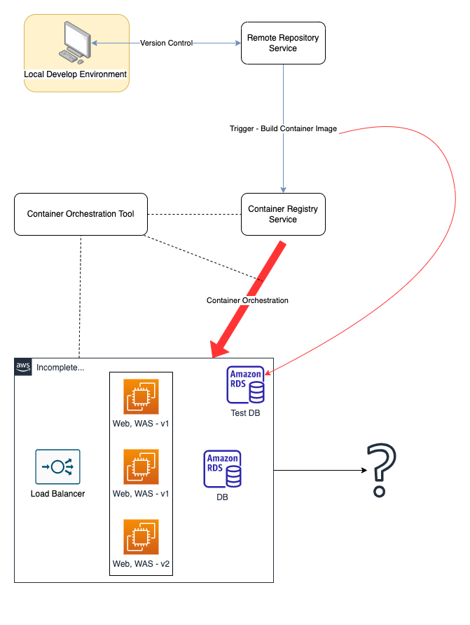

# 💻 OAuth

## 📚 Content
1. Reference book
2. Reference book refactoring version
3. To be in CFI project...

## 📒 Reference Book
### Architecture

#### 1. AWS Service (Infrastructure)
* EC2 (Elastic Compute Cloud)
* RDS (Relational Database Service)
* Elastic IP
#### 2. Application
* Spring Boot(v2.1.7), Spring Security, Spring Data JPA
* Mustache
* H2-Database
#### 3. Version Control (SCM - Software Configuration Management)
* Git
* Github
#### 4. CI/CD
* SSH
* Shell Script

## 📔 Reference Book Refactoring Version
### Architecture

#### 1.Application
* Spring Boot(v2.4.13), Spring Security, Spring Data JPA, Querydsl

####2. Container
* Docker
* Docker-Compose

## 📖 Reference
* 스프링 부트와 AWS로 혼자 구현하는 웹 서비스